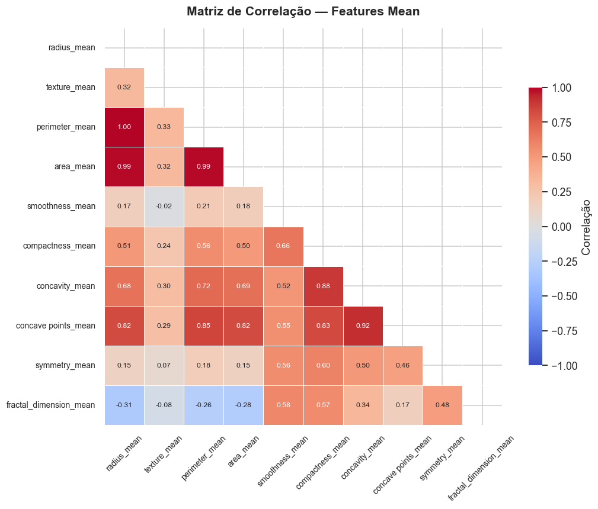
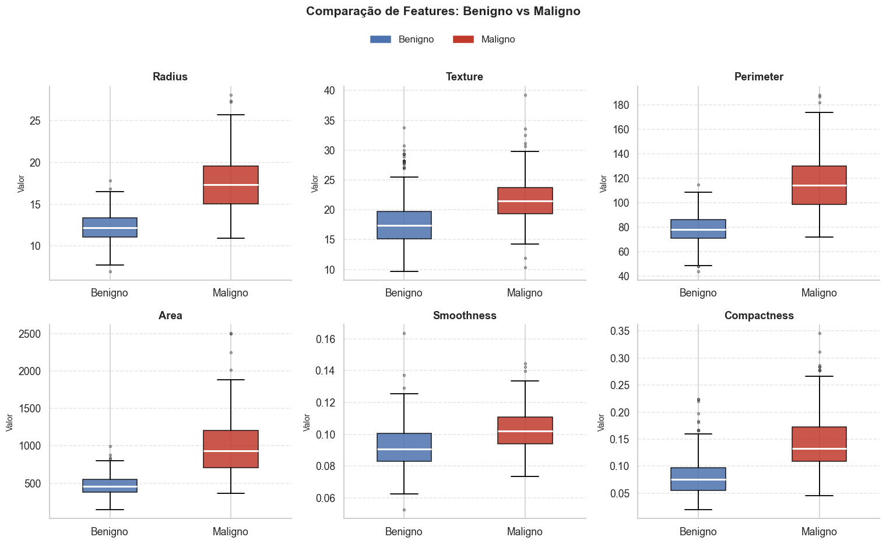
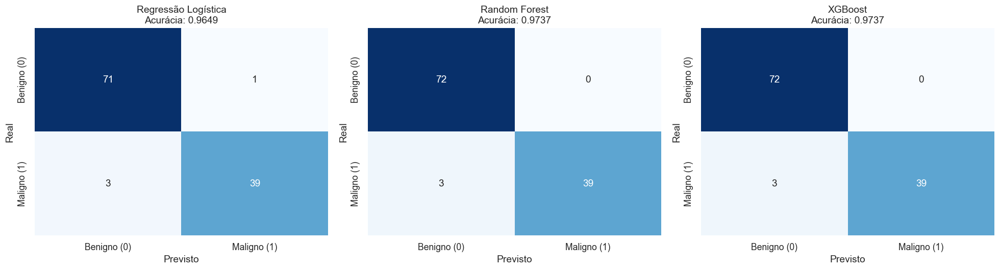
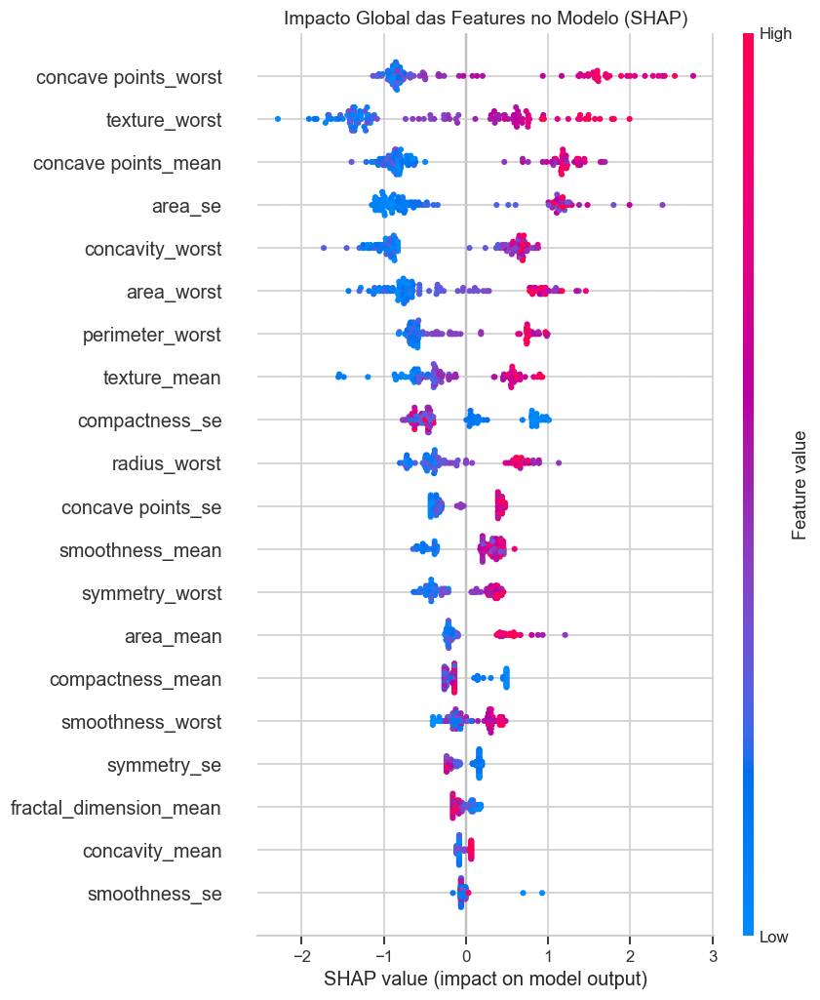

# 🎗️ Breast Cancer Classification

> Classificação de tumores mamários como **benignos** ou **malignos** a partir do Wisconsin Breast Cancer Dataset, utilizando técnicas de Machine Learning e interpretabilidade com SHAP values.

---

## 📋 Sobre o Projeto

O Wisconsin Breast Cancer Dataset foi utilizado como base para a construção de um pipeline completo de classificação binária. Características morfológicas extraídas de imagens de células foram analisadas e utilizadas no treinamento de três modelos de classificação. A interpretabilidade das predições foi garantida por meio de SHAP values.

---

## 📂 Estrutura do Projeto

```
breast-cancer/
│
├── data/
│   └── data.csv                  # Dataset original (Wisconsin Breast Cancer)
│
├── notebooks/
│   └── breast_cancer.ipynb       # Notebook principal com todo o pipeline
│
├── outputs/
│   ├── figures/                  # Gráficos gerados durante a EDA
│   │   ├── distribuicao_diagnosticos.png
│   │   ├── matriz_correlacao.png
│   │   ├── boxplots_features.png
│   │   ├── violin_plot.png
│   │   └── joint_plot.png
│   └── reports/
│       ├── classification_report.txt
│       └── confusion_matrices.png
│
├── .gitignore
├── requirements.txt
└── README.md
```

---

## 🔬 Pipeline

```
Carregamento → Limpeza → EDA → Pré-processamento → Treinamento → Avaliação → Interpretabilidade
```

| Etapa | Descrição |
|---|---|
| **Carregamento & Limpeza** | Remoção da coluna `id` e colunas totalmente nulas |
| **EDA** | Distribuição de classes, correlações, boxplots, violin e joint plot |
| **Pré-processamento** | Label Encoding, Train/Test Split (80/20), StandardScaler |
| **Treinamento** | Regressão Logística, Random Forest, XGBoost |
| **Avaliação** | Matrizes de confusão e acurácia por modelo |
| **Interpretabilidade** | SHAP summary plot (dot) e bar plot |

---

## 📊 Resultados

| Modelo | Acurácia |
|---|---|
| Regressão Logística | 96.49% |
| Random Forest | **97.37%** |
| XGBoost | **97.37%** |

> ⚠️ **Recall da classe Maligno** foi priorizado na análise, pois falsos negativos (tumores malignos classificados como benignos) representam o erro de maior impacto clínico.

---

## 🔍 Destaques da Análise

### Análise Exploratória (EDA)

**Correlação entre features de tamanho:**
Foi identificada altíssima multicolinearidade (correlação próxima a 1.0) entre `radius_mean`, `perimeter_mean` e `area_mean`. Matematicamente esperado, pois área e perímetro são derivados do raio — porém crítico de mapear, pois algoritmos lineares sofrem com esse fenômeno.



**Separação entre classes:**
Features ligadas ao tamanho celular apresentam separação visual clara entre benignos e malignos. Tumores malignos exibem distribuições consistentemente mais elevadas, indicando forte poder preditivo dessas variáveis.



---

### Treinamento e Avaliação

Foram treinados três modelos: *Regressão Logística* (baseline linear para classificação binária) e dois algoritmos ensemble — *Random Forest* e *XGBoost*.



A análise focou no quadrante de **Falsos Negativos** (tumor maligno classificado como benigno), que representa o erro de maior impacto clínico. Modelos baseados em árvores demonstraram melhor capacidade de capturar a fronteira de decisão complexa entre as classes.

---

### Explainable AI com SHAP

Para garantir que o modelo baseou suas decisões em critérios biologicamente coerentes — e não em ruídos dos dados — foi aplicada a biblioteca **SHAP (SHapley Additive exPlanations)** sobre o XGBoost.



- Cada ponto representa um paciente do conjunto de teste
- **Cores quentes (vermelho):** valor original alto da feature
- **Cores frias (azul):** valor original baixo
- Features como `concave points_worst` e `area_se` empurram fortemente a predição para Maligno quando seus valores são altos — consistente com a biologia tumoral, onde irregularidade e tamanho celular estão associados à malignidade

### Features Mais Importantes (SHAP)

As 5 features com maior impacto global no modelo XGBoost foram:

1. `concave points_worst`
2. `texture_worst`
3. `concave points_mean`
4. `area_se`
5. `concavity_worst`

---

## ⚙️ Como Executar

### 1. Clone o repositório
```bash
git clone https://github.com/seu-usuario/breast-cancer.git
cd breast-cancer
```

### 2. Crie e ative o ambiente virtual
```bash
python -m venv venv

# Windows
venv\Scripts\activate

# Linux / macOS
source venv/bin/activate
```

### 3. Instale as dependências
```bash
pip install -r requirements.txt
```

### 4. Execute o notebook
```bash
jupyter notebook notebooks/breast_cancer.ipynb
```

---

## 📦 Dependências

```
pandas
numpy
matplotlib
seaborn
scikit-learn
xgboost
shap
jupyter
```

> O arquivo `requirements.txt` com versões fixadas está disponível na raiz do projeto.

---

## 📁 Dataset

O **Wisconsin Breast Cancer Dataset** é amplamente utilizado em benchmarks de machine learning para classificação binária na área médica.

- **Amostras:** 569
- **Features:** 30 características numéricas (média, erro padrão e pior valor de 10 atributos)
- **Classes:** Benigno (357 — 62.7%) / Maligno (212 — 37.3%)
- **Fonte:** [UCI Machine Learning Repository](https://archive.ics.uci.edu/ml/datasets/Breast+Cancer+Wisconsin+%28Diagnostic%29)