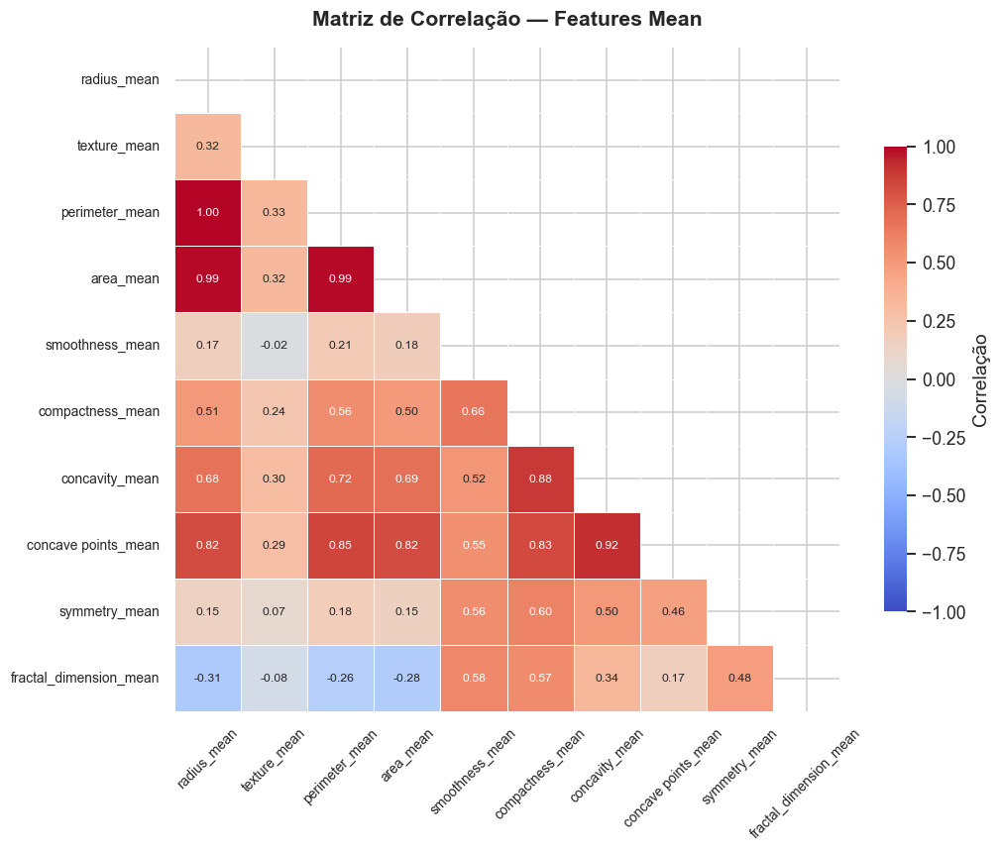
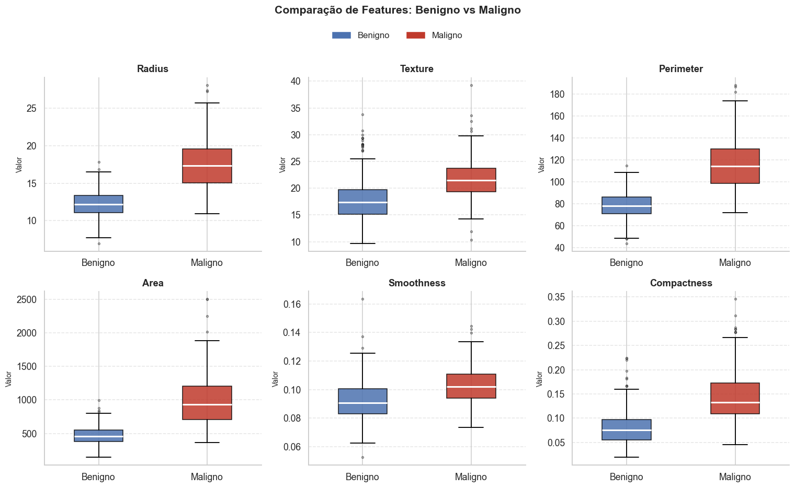
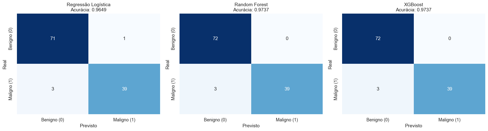
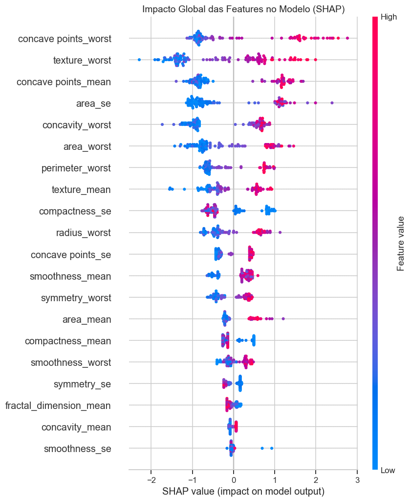

# 🎗️ Breast Cancer Classification

> Classification of breast tumors as **benign** or **malignant** using the Wisconsin Breast Cancer Dataset, applying Machine Learning techniques and model interpretability with SHAP values.

---

## 📋 About the Project

The Wisconsin Breast Cancer Dataset was used as the foundation for building a complete binary classification pipeline. Morphological features extracted from cell images were analyzed and used to train three classification models. Prediction interpretability was ensured through SHAP values.

---

## 📂 Project Structure

```plaintext
breast-cancer/
│
├── data/
│   └── data.csv                  # Original dataset (Wisconsin Breast Cancer)
│
├── notebooks/
│   └── breast_cancer.ipynb       # Main notebook containing the full pipeline
│
├── outputs/
│   ├── figures/                  # Charts generated during EDA
│   │   ├── distribuicao_diagnosticos.png
│   │   ├── matriz_correlacao.png
│   │   ├── boxplots_features.png
│   │   ├── violin_plot.png
│   │   └── joint_plot.png
│   └── reports/
│       ├── classification_report.txt
│       └── confusion_matrices.png
│
├── .gitignore
├── requirements.txt
└── README.md
```

---

## 🔬 Pipeline

```plaintext
Loading → Cleaning → EDA → Preprocessing → Training → Evaluation → Interpretability
```

| Step                   | Description                                                               |
| ---------------------- | ------------------------------------------------------------------------- |
| **Loading & Cleaning** | Removal of the `id` column and fully null columns                         |
| **EDA**                | Class distribution, correlations, boxplots, violin plots, and joint plots |
| **Preprocessing**      | Label Encoding, Train/Test Split (80/20), StandardScaler                  |
| **Training**           | Logistic Regression, Random Forest, XGBoost                               |
| **Evaluation**         | Confusion matrices and model accuracy                                     |
| **Interpretability**   | SHAP summary plot (dot) and bar plot                                      |

---

## 📊 Results

| Model               | Accuracy   |
| ------------------- | ---------- |
| Logistic Regression | 96.49%     |
| Random Forest       | **97.37%** |
| XGBoost             | **97.37%** |

> ⚠️ **Recall for the Malignant class** was prioritized during the analysis because false negatives (malignant tumors classified as benign) represent the most clinically impactful error.

---

## 🔍 Analysis Highlights

### Exploratory Data Analysis (EDA)

**Correlation between size-related features:**
A very high multicollinearity (correlation close to 1.0) was identified between `radius_mean`, `perimeter_mean`, and `area_mean`. This is mathematically expected since area and perimeter are derived from radius — however, mapping this relationship is critical because linear algorithms are sensitive to multicollinearity.



**Class separation:**
Features related to cell size show a clear visual separation between benign and malignant tumors. Malignant tumors consistently present higher distributions, indicating strong predictive power for these variables.



---

### Training and Evaluation

Three models were trained: *Logistic Regression* (linear baseline for binary classification) and two ensemble algorithms — *Random Forest* and *XGBoost*.



The analysis focused on the **False Negative** quadrant (malignant tumor classified as benign), which represents the most critical clinical error. Tree-based models demonstrated a better ability to capture the complex decision boundary between classes.

---

### Explainable AI with SHAP

To ensure that the model based its decisions on biologically coherent criteria — rather than noise in the data — the **SHAP (SHapley Additive exPlanations)** library was applied to the XGBoost model.



* Each point represents a patient from the test set
* **Warm colors (red):** high original feature value
* **Cool colors (blue):** low original feature value
* Features such as `concave points_worst` and `area_se` strongly push predictions toward Malignant when their values are high — consistent with tumor biology, where irregularity and cell size are associated with malignancy

### Most Important Features (SHAP)

The 5 features with the greatest global impact on the XGBoost model were:

1. `concave points_worst`
2. `texture_worst`
3. `concave points_mean`
4. `area_se`
5. `concavity_worst`

---

## ⚙️ How to Run

### 1. Clone the repository

```bash
git clone https://github.com/your-username/breast-cancer.git
cd breast-cancer
```

### 2. Create and activate the virtual environment

```bash
python -m venv venv

# Windows
venv\Scripts\activate

# Linux / macOS
source venv/bin/activate
```

### 3. Install dependencies

```bash
pip install -r requirements.txt
```

### 4. Run the notebook

```bash
jupyter notebook notebooks/breast_cancer.ipynb
```

---

## 📦 Dependencies

```plaintext
pandas
numpy
matplotlib
seaborn
scikit-learn
xgboost
shap
jupyter
```

> The `requirements.txt` file with pinned versions is available in the project root.

---

## 📁 Dataset

The **Wisconsin Breast Cancer Dataset** is widely used in machine learning benchmarks for binary classification in the medical domain.

* **Samples:** 569
* **Features:** 30 numerical characteristics (mean, standard error, and worst value of 10 attributes)
* **Classes:** Benign (357 — 62.7%) / Malignant (212 — 37.3%)
* **Source:** https://archive.ics.uci.edu/ml/datasets/Breast+Cancer+Wisconsin+(Diagnostic)